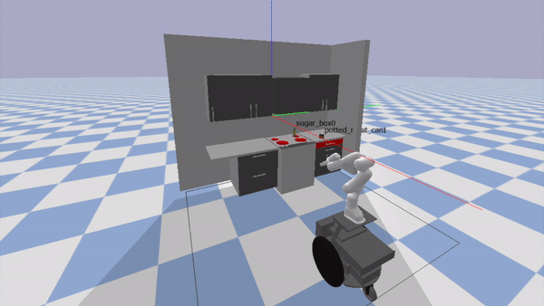
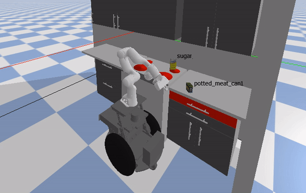
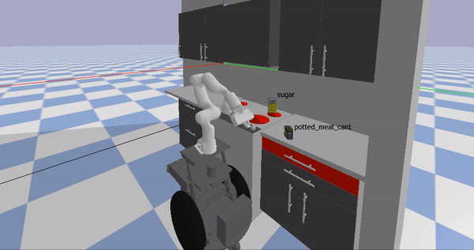

# PADM Final Project - Grant Appel and Mason Peterson

This README contains the logic and flow of the code in the repo

# **ACTIVITY PLANNER**
## Assumptions for our PDDL Domain

We first assumed that there were only three objects that we needed to consider - the sugar, the spam, and the drawer handles. The gripper was not thought of as a an object because we assumed that the location of the gripper would be known at all times and the gripper itself would not be moved around by anything and would act as the vehicle for the other objects to move. Additionally, we assume that the gripper can only grab one of the objects at a time; for example, if the gripper is holding the sugar, it is not able to grab the spam until the sugar has been release. The location aspect of the domain was covered by three different predicates:

on-burner ?i, in-drawer ?i, and on-counter ?i

where the ?i denotes an item type object (spam or sugar). Each of these is set to true if the item is at that location and set to false once the gripper moves them. The gripper location was covered by setting an additoinal predicate:

gripper-at-object ?o

for this predicate ?o denotes any object (the sugar, spam and drawer handle). This predicate is set true once an action is chosen for the gripper to move to an object. Alternatively, this predicate is set false after the object has been released and an action is called for the gripper to move away from the object. This means that after each object is moved, the gripper will "reset" at a default location, which will add a small amount of time to the execution, but this was determined to be acceptable. 

## PDDL File and Problem Formulation

The actual PDDL domain and all corresponding objects, predicates and actions can be found in the [sugar_spam_pddl.pddl](https://github.com/mbpeterson70/padm_project_peterson_appel/blob/main/src/sugar_spam_pddl.pddl) file and the problem statement can be found in the [p1.pddl](https://github.com/mbpeterson70/padm_project_peterson_appel/blob/main/src/p1.pddl) file. 

### Initial State

The initial state was given in our problem statement. This includes:

1. Sugar on the burner (on-burner su)
2. Spam on the counter (on-counter sp)
3. The gripper away from the counter and empty (gripper-empty)

### Goal State

The final state with respect to our problem formulations is:

1. Sugar on the counter (on-counter su)
2. Spam in the drawer (in-drawer sp)
3. The gripper is empty (gripper-empty)
4. The gripper robot is still at the counter (base-at-counter)
5. The gripper has "reset" to its default locaiton (gripper-away-from-objects)
6. The drawer is closed (not(drawer-open))

### Check

Our first step in checking that our pddl domain and problem statement were correct was getting them to work correctly with the provided pddl parser. This was accomplished and we were able to get a list of actions from the initial state to the goal state by using the example activity planner provided.

Our next step will be creating an activity planner that encorporates a calculated fast-forward heuristic to get the optimal path from our intial state and goal state. 

# **MOTION PLANNER**

### Overview

The motion planner is responsible for creating specific plans for the motion of the arm and base to perform the activities planned in the activity planner phase. To accomplish this, we used two main files:

* `motion_planner.py` contains code for planning sample-based paths for the arm and base given a desired goal configuration. Implements a Rapidly exploring Random Tree (RRT) algorithm with collision checking for arm and base.
* `activity_executor.py` contains code to set up the motion plan for each of the different activities contained in the activity plan. For example, this file would let the motion planner know the robots goal pose it needs to reach the counter and informs the motion planner if the gripper is holding an object.

Additionally, we created a simulation file to sequentially run the activity planner, motion planner, and trajectory optimization: `project_simulation.py`. This file borrowed the setup from the project example. Run this file to run the simulation.

### Assumptions

Our primary assumptions are that we know the configuration of the environment a priori. This includes:
* We know the location of the spam and sugar.
* We can query the simulation to find the locations of the cupboards and drawers.
* We can query the simulation to find the configuration of the robot and the individual link poses.

We rely on this knowledge of the environment to perform collision-checking and to find goal poses for our RRT motion planning. We keep any poses not received from the environment (spam and sugar) in the `world_params.py` file.
### Motion Plan Formulation

The activity executor receives a list of activities to perform. The activity executor iteratively calls a function associated with each activity in order, passing to that function that parameters associated with the activity.

Activities that involve the gripper or base moving use the goal location parameter and its knowledge of the environment to create a goal pose for the base or gripper. The activity executor then calls the motion planner to create a plan to get to the goal pose.

We implemented RRT with goal-biasing and collision checking to create the motion plan. For the gripper, RRT is performed within the gripper's configuration space, i.e. RRT samples a 7x1 random configuration within the bounds of the gripper's joints. We use pybullet's inverse kinematics to get a goal arm configuration given a goal pose. We will not explain the full details of RRT here, but in general RRT constructs a tree uses a series random samples connected with their nearest neighbors to create a series of joint configurations that eventually result in the goal configuration. We use a maximum edge length of .01 radians and goal biasing every 5 samples to help RRT converge to a plan. The algorithm checks that for every intermediate configuration, no arm link is in collision with any part of the kitchen or itself. Because the edge length is very small and to help the algorithm run quickly, we assume that if the norm of the difference between any two configurations < .01 radians, no collisions will happen between the two configurations.

Once the plan has been generated, we reconfigure the robot arm to each configuration within the plan until the gripper reaches the goal pose. If the gripper is holding an object, we find the object's new rotation and translation based on the gripper's new translation and rotation, and we simulate the object's motion along with the arm's movement.

We also use RRT for the base motion. We perform RRT in the 2D ground plane for the base motion. Once a 2D path to the goal pose has been found, the robot drives there, pivoting at each 2D waypoint to point in the direction of the next node in the plan. Finally, it rotates to the goal rotation once it has reached its goal position.
### Results

Here we show our simulation running. 

We found that overall, our motion planner performs quite well. We had to hard-code a couple of things to help it though.
1. The robot must be sideways, very close to the counter to be able to reach all the objects. To make this happen, we had to plan a motion to the side of the counter and then turn and drive strate parallel to counter to the goal pose.
2. The robot struggled to find a few goal poses that were very close to the walls of the kitchen (in particular, to and from the burner). To help speed up the RRT, we provided an intermediate pose in between the start and goal pose to make finding a path easier.

### Image

Start of simulation. More to come.

# TRAJECTORY OPTIMIZATION

