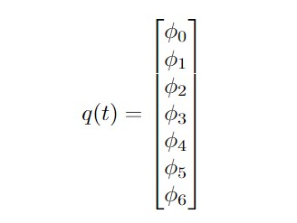

# PADM Final Project - Grant Appel and Mason Peterson

# **Introduction**

The goal of this project was to demonstrate understanding of the topics introduced throughout the semester in a real world application. The learning objectives for the activity planner were to understand how to formalize a problem in PDDL format and solve the activity planning problem with a search algorithm and appropriate heuristic. The learning objective for the motion planning section was to understand how to implement a sampling based motion planner with a complex autonomous system and interact with a simulation environment. Finally, the learning objectives for the trajectory optimization section were to show that the non-optimal trajectory developed by various sampling based methods can be dramatically improved upon and to learn how to formalize a trajectory optimization problem with the necessary objective cost function and constraints.

This following README contains the logic and flow of the code in the repo.

# **ACTIVITY PLANNER**

## Assumptions for our PDDL Domain

We first assumed that there are five types of objects we need to consider: items (sugar and spam), locations (counter, burner, at handle) the handle, the drawer, and the gripper. We assumed that the location of the gripper would be known at all times and the gripper itself would not be moved around by anything and would act as the vehicle for the other objects to move. Additionally, we assume that the gripper can only grab one of the objects at a time.

The location aspect of the domain was covered by a single predicate:

`at-location ?o ?l`

where the ?o denotes an object and ?l denotes a location. We set the location of the gripper, spam, and sugar at the beginning of the problem and formulate the actions such that an object can only be at one location at once. Additionally, we set the location of the handle at 'at-handle' which cannot be changed.

We assume that if the gripper and an object are at the same location, the gripper can pick up that object. We also assume that the gripper can be at the same location as an object, but no other two objects can be at the same location.

## PDDL File and Problem Formulation

The actual PDDL domain and all corresponding objects, predicates and actions can be found in the [kitchen.pddl](src/kitchen.pddl) file and the problem statement can be found in the [project_problem.pddl](src/project_problem.pddl) file. 

### Initial State

The initial state was given in our problem statement. This includes:

1. Sugar on the burner (`at-location su on-burner`)
2. Spam on the counter (`at-location sp on-counter`)
3. The gripper away from the counter and empty (`at-location g away-from-objects` and `gripper-empty`)
4. The drawer closed
5. The drawer empty (`location-empty d`)

### Goal State

The final state with respect to our problem formulations is:

1. Sugar on the counter (`at-location su on-counter`)
2. Spam in the drawer (`at-location sp d`)
3. The gripper is empty (`gripper-empty`)
4. The gripper robot is still at the counter (`base-at-counter`)
5. The gripper has "reset" to its default location (`at-location g away-from-objects`)
6. The drawer is closed (`not(drawer-open)`)

### Activity Planner

Our first step in checking that our pddl domain and problem statement were correct was getting them to work correctly with the provided PDDL parser and our own BFS planner. This was accomplished and we were able to get a list of actions from the initial state to the goal state by using the example activity planner provided.

To create a fast planner, we use A* with an admissible relaxed moves heuristic. A* with a visited list, as we learned in class, is a tree-based search pattern that places new children on the queue in order of the distance traveled to that child plus an admissible heuristic modeling the cost-to-go. We assume each action has the same constant cost of 1. So, to use A* with a visited list, we needed to use an admissible heuristic.

For our admissible heuristic, we chose the path length of a relaxed problem where delete effects are not added. This heuristic counts the number of actions that are needed to reach the goal state if any positive effects are kept for all future states. This is guaranteed to always be optimistic and thus is an admissible heuristic.

Here is an example output of our action plan:

```
move-to-base ()
move-gripper ('g', 'away-from-objects', 'at-handle')
grab-handle ('g', 'h', 'at-handle')
open-drawer ('h',)
release-object ('g', 'at-handle', 'h')
move-gripper ('g', 'at-handle', 'on-counter')
grab-item ('g', 'sp', 'on-counter')
move-item-to-drawer ('g', 'sp', 'on-counter', 'd')
release-object ('g', 'd', 'sp')
move-gripper-from-drawer ('g', 'd', 'on-burner')
grab-item ('g', 'su', 'on-burner')
move-item ('g', 'su', 'on-burner', 'on-counter')
release-object ('g', 'on-counter', 'su')
move-gripper ('g', 'on-counter', 'at-handle')
grab-handle ('g', 'h', 'at-handle')
close-drawer ('h',)
release-object ('g', 'at-handle', 'h')
move-gripper ('g', 'at-handle', 'away-from-objects')
```

The activity planner executes in .007 seconds.

# **MOTION PLANNER**

### Overview

The motion planner is responsible for creating specific plans for the motion of the arm and base to perform the activities planned in the activity planner phase. To accomplish this, we used two main files:

* `motion_planner.py` contains code for planning sample-based paths for the arm and base given a desired goal configuration. Implements a Rapidly exploring Random Tree (RRT) algorithm with collision checking for arm and base.
* `activity_executor.py` contains code to set up the motion plan for each of the different activities contained in the activity plan. For example, this file would let the motion planner know the robots goal pose it needs to reach the counter and informs the motion planner if the gripper is holding an object.

Additionally, we created a simulation file to sequentially run the activity planner, motion planner, and trajectory optimization: `project_simulation.py`. This file borrowed the setup from the project example. Run this file to run the simulation.

### Assumptions

Our primary assumptions are that we know the configuration of the environment a priori. This includes:
* We know the location of the spam and sugar.
* We can query the simulation to find the locations of the cupboards and drawers.
* We can query the simulation to find the configuration of the robot and the individual link poses.

We rely on this knowledge of the environment to perform collision-checking and to find goal poses for our RRT motion planning. We keep any poses not received from the environment (spam and sugar) in the `world_params.py` file.
### Motion Plan Formulation

The activity executor receives a list of activities to perform. The activity executor iteratively calls a function associated with each activity in order, passing to that function that parameters associated with the activity.

Activities that involve the gripper or base moving use the goal location parameter and its knowledge of the environment to create a goal pose for the base or gripper. The activity executor then calls the motion planner to create a plan to get to the goal pose.

We implemented RRT with goal-biasing and collision checking to create the motion plan. For the gripper, RRT is performed within the gripper's configuration space, i.e. RRT samples a 7x1 random configuration within the bounds of the gripper's joints. We use pybullet's inverse kinematics to get a goal arm configuration given a goal pose. We will not explain the full details of RRT here, but in general RRT constructs a tree uses a series random samples connected with their nearest neighbors to create a series of joint configurations that eventually result in the goal configuration. We use a maximum edge length of .01 radians and goal biasing every 5 samples to help RRT converge to a plan. The algorithm checks that for every intermediate configuration, no arm link is in collision with any part of the kitchen or itself. Because the edge length is very small and to help the algorithm run quickly, we assume that if the norm of the difference between any two configurations < .01 radians, no collisions will happen between the two configurations.

Once the plan has been generated, we reconfigure the robot arm to each configuration within the plan until the gripper reaches the goal pose. If the gripper is holding an object, we find the object's new rotation and translation based on the gripper's new translation and rotation, and we simulate the object's motion along with the arm's movement.

We also use RRT for the base motion. We perform RRT in the 2D ground plane for the base motion. Once a 2D path to the goal pose has been found, the robot drives there, pivoting at each 2D waypoint to point in the direction of the next node in the plan. Finally, it rotates to the goal rotation once it has reached its goal position.
### Results


Here we show our simulation running. 

We found that overall, our motion planner performs quite well. We had to hard-code a couple of things to help it though.
1. The robot must be sideways, very close to the counter to be able to reach all the objects. To make this happen, we had to plan a motion to the side of the counter and then turn and drive strate parallel to counter to the goal pose.
2. The robot struggled to find a few goal poses that were very close to the walls of the kitchen (in particular, to and from the burner). To help speed up the RRT, we provided an intermediate pose in between the start and goal pose to make finding a path easier.

### Image

Start of simulation. More to come.

# **TRAJECTORY OPTIMIZATION**

## Implementation:

For the trajectory optimization, we began with the understanding that the gripper pose was represented by a vector of the seven arm joint angles.



Then we modeled the trajectory of each arm joint angle over time as a cubic bezier curve - a bezier curve controlled by 4 points. 


The bezier curve is a function of u which itself is a function of t in our formulation. The T is the total number of time steps, where t is the time step of the point. Therefore giving the relation: 0 <= u <= 1. The problem was constrained by stating that the first and last bezier coefficient equaled the start and goal joint angle. 


Another constraint was added that all the joint angles were always within their feasible bounds. 

Additionally, constraints were added to the derivatives of the bezier curve. The first derivative was constrained to never cross zero in order to ensure the joints don't pass the desired goal and then oscilate to settle down on it. The second derivative was constrained to always be opposite signs as the first derivative for similar reason as the first. The final constraint added was to ensure that the difference in the discrete time stepped positions never exceeded pi/10. This acted as a velocity constraint. 


Next with these constraints coded, the objective cost was defined as a pseudo euclidian distance between each discrete point on each bezier curve to its respective final goal position. This was choosen so that the optimizer would move the two middle control points in such a manner that the gripper trajectory would approach the final goal as fast as possible and then settle down on the goal position. 


Our trajectory optimization code did not itself account for collision detection. To account for this the optimizer was given an initial guess of the trajectory found from our RRT code that did account for collision detection. Namely, the initial and final condition were the same as the constraints outlined above, but the second and third control points of the bezier curve were chosen to be the configurations at times T/3 and 2T/3 respectively. Then our optimizer optimized the problem by changing the second and third control points to optimize based on the cost described above. 

## Code
* `trajectory_optimization.py` contains code for optimzing the gripper trajectory. This code defines the bezier curve as a funciton of u which is a funciton of t. It also defines the first and second derivatives of the bezier curve. Then using the standard PyDrake MathematicalProgram library, our code optimizes the gripper trajectory to get to the drawer handle.  

## Comparison
* Standard RRT


* Optimized Trajectory using Bezier Curve Formulation


# **Conclusion**
## Reflection/Discussion/Issues

Overall I feel that we learned a lot throughout the project and saw that many complex issues are needed to be solved in order to transfer what we have learned in the classroom to a real world application. For future years, we feel like much work could go into improving the accessibility of the base code libraries such as PyBullet and PyDrake. Though we were able to get them to work for our implementation, many (unnecessary) hours were spent digging into uncommented code to see how we could potentially use it for our application. 

## Individual Contributions
* Mason: Developed the code for the A* search for activity planned, the hueristic for activity planner using BFS, the RRT for the arm motion planning,and developed the code necessary to integrate the various parts of the problem together. Additionally, helped 
* Grant: Developed the code for the relaxed plan graph heuristic (ended up being slower so did not use), the RRT for the robot base motion plannign, and developed the trajectory optimization problem using bezier curves
* Both: Worked together to convert the problem into a PDDL for the activity planning, wrote up the README
